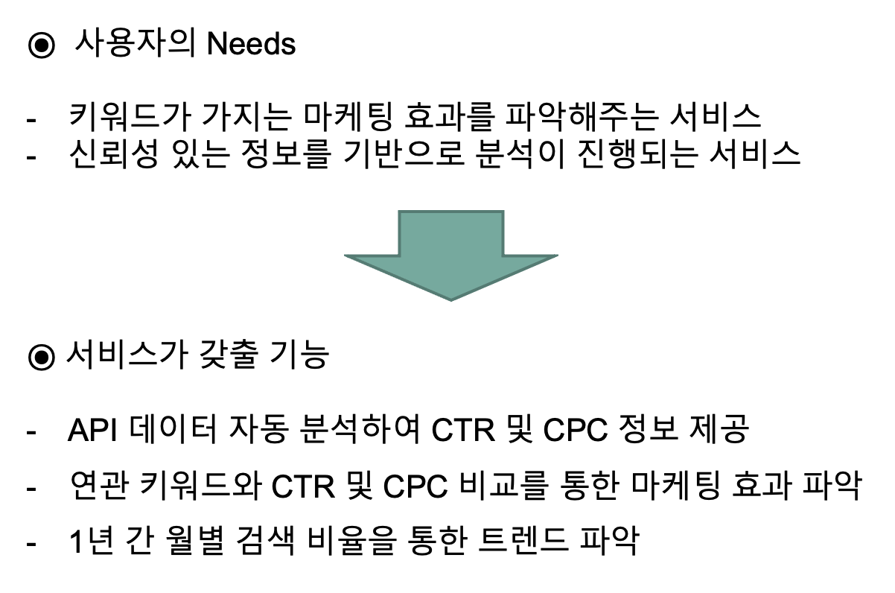
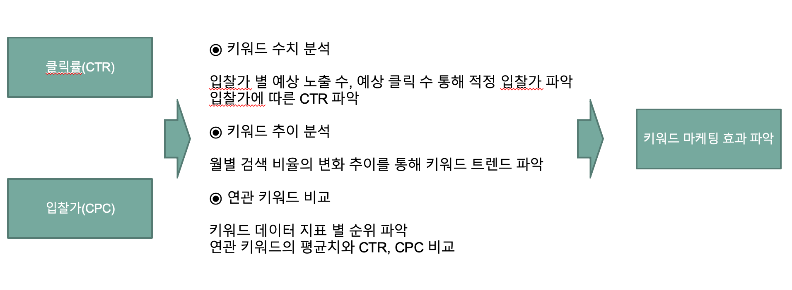
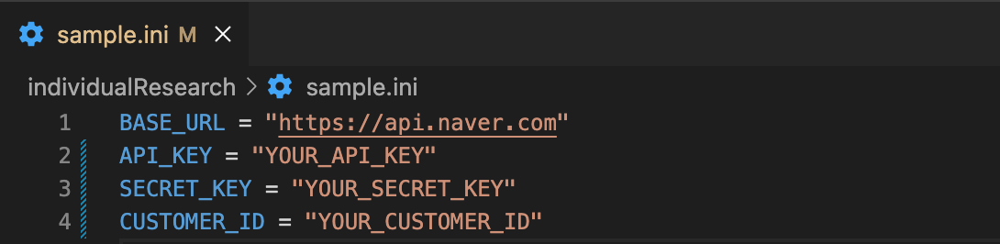
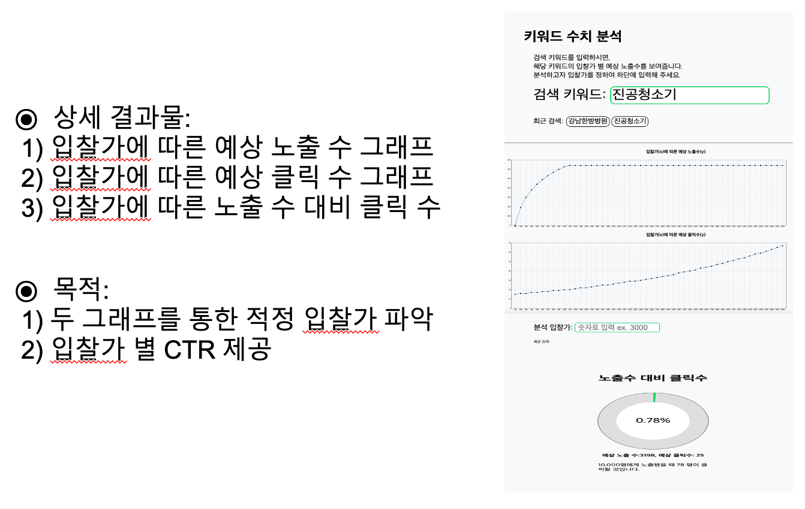
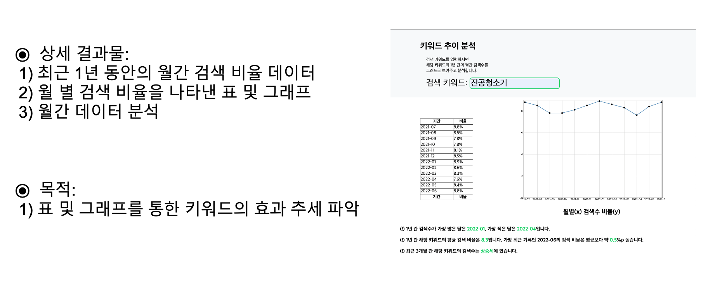
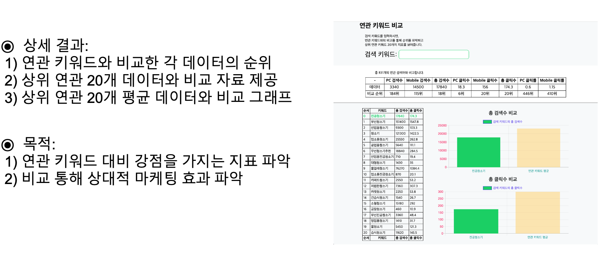

# SearchAdProject

<h2>2022 여름학기 컴퓨터공학전공 개별연구  [웹 정보의 빅데이터를 통한 사용자 편의 서비스 연구]</h2>
 
<h2>세부 주제  [네이버 API 데이터 기반 키워드 데이터 분석 및 비교 연구] Analayzing and comparing keyword data based of Naver Website API data</h2>

<h2>개요</h2>

검색 광고의 비중이 점점 높아지면서, 키워드 데이터를 분석하여 마케팅 효과를 추정하고 파악하는 것이 중요해 졌다. 유사 서비스 분석 과정에서, 검색 광고에서 키워드가 가진 마케팅 효과를 추정하기 위해 고려해야 할 가장 중요한 지표인 CTR과 CPC을 제대로 제공하지 않는 것을 발견하였다. 이에 따라 본 연구는 키워드 데이터를 분석하여 CTR과 CPC에 대한 정보를 추출하고, 이를 연관 키워드와 비교할 수 있게끔 하여 개별 키워드가 가지는 마케팅 효과를 추정할 수 있도록 하는 웹 서비스를 제작하는 것을 목표로 한다.

<h2>제공 기능 및 가치</h2>

<h2>실행 방법</h2>
<h4>1. php 설치</4>
 

출처: https://opentutorials.org/course/62/2534 생활코딩 php 설치

php 설치 및 각 실행 환경에서 서버 실행

<h4>2. 네이버 API 라이선스 발급</4>
<h5>2-1 네이버 검색광고 API </h5>

https://searchad.naver.com/ 가입 후 '키워드 도구 -> 도구 -> API 사용 관리'에서 네이버 검색광고 API 서비스 신청

발급 받은 API_KEY, SECRET_KEY, CUSTOMER_ID를 individualReserach/sample.ini 파일에 입력

<h5>2-2 네이버 검색광고 API </h5>

https://developers.naver.com/main/  'Application -> Application 등록' 

발급 받은 Client Id, Client Secret을 individualReserach/service2.php 파일에 입력(124~125번쨰 줄)

<h2>세부 기능</h2>
<h3>키워드 수치 분석 - service1.php</h3>

실행영상: https://youtu.be/Xi3OEJPAXSA

<h3>키워드 추이 분석 - service2.php</h3>

실행영상: https://youtu.be/8Xl6sfIrjzY

<h3>연관 키워드 비교 - service3.php</h3>

실행영상: https://youtu.be/3V17ZRZim_Y

<h2>용어 설명</h2>

term.txt 참고
